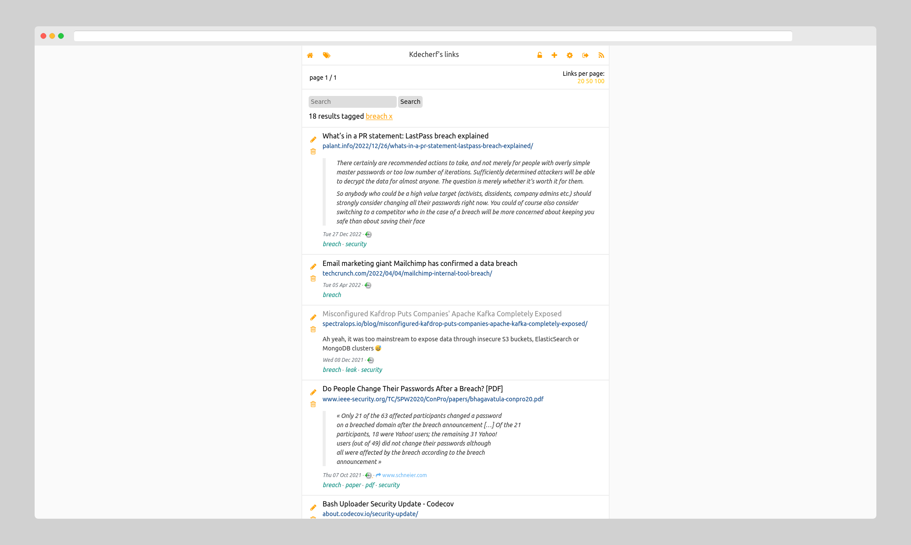

# shaarli-hacker

shaarli-hacker is a theme for shaarli, a personal, minimalist, bookmarking
service.

It has been inspired by [HackerWeb](https://hackerweb.app).

Tested with shaarli v0.11.

Tested with the following plugins: via, archiveorg, markdown.

## Installation

Upload `hacker` folder into `tpl/`, then enable it through admin panel.
